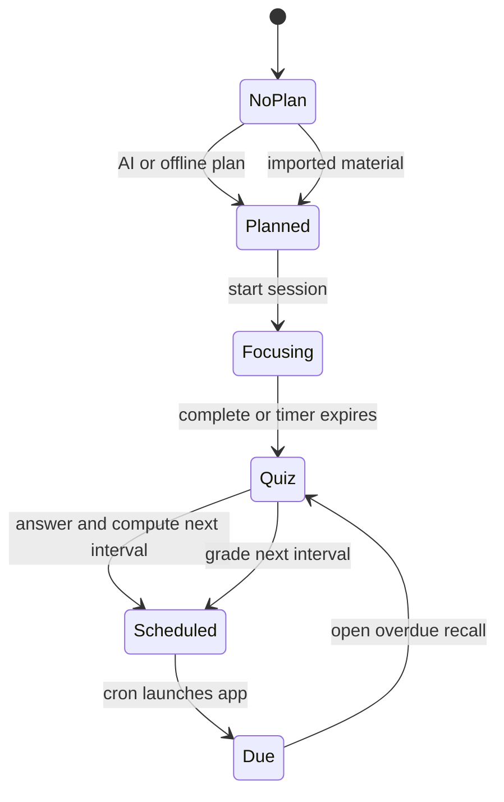

# FocusLoop architecture

## Design principle

FocusLoop separates semantic work, context decisions, and device execution. The language model turns a spoken topic or imported material into concise recall cards with explanations. Local code validates that structure, maintains learning state, evaluates whether the current context is suitable, and selects the next card. Agent tools persist future actions and reopen the application when a review is due.

This keeps the core loop usable when the model, network, or provider configuration is unavailable.

## Components

| Component | Responsibility | Failure behavior |
| --- | --- | --- |
| QuickApp pages | Dashboard, plan, focus timer, quiz, smart review window | State is restored from `system.storage` |
| `agent_protocol.js` | Prompt construction, tagged JSON extraction, bounds checking | Rejects malformed or unconfirmed results |
| `scheduler.js` | Deterministic spaced repetition | Fully offline and unit tested |
| `context.js` | Opt-in review-window decision from stress, motion, due time, and cooldown | No recommendation when a required signal is missing |
| `context_monitor.js` | App-scope health and motion subscriptions plus feedback updates | Stops cleanly when disabled; time-based Agent reminder remains independent |
| `@system.velaclaw` | QuickApp-to-Agent bridge | Plan creation falls back offline; schedules remain pending |
| `ai_agent` voice channel | PTT recording and ASR transcript | Plan page reports voice unavailable without blocking text presets |
| `service.health` / `system.sensor` | Stress and accelerometer samples | Isolated smart-window page reports unsupported capability |
| FocusLoop Skill | Tool policy for SCHEDULE, REVIEW, and IMPORT | Restricts file paths and verifies real tool results |
| `cron_add` | Persistent future action | Deduplicated with `cron_list` |
| `launch_quickapp` | Proactive app launch | Opens home, which detects an overdue card |

## State machine

`pendingScheduleAt` is persisted before the Agent call. The home page retries schedule synchronization after app restart or transient Agent failure. The flag is cleared only after a structured `scheduled:true` result.

## Smart review window

The feature is disabled by default. After opt-in, a recommendation is eligible only when all conditions are true:

1. At least one learning session has been completed.
2. The next card is due or will be due within 30 minutes.
3. The latest stress sample is at or below the configured threshold (25 by default).
4. At least six accelerometer samples indicate low movement.
5. No recommendation has been sent in the previous 30 minutes.

The decision runs locally in `context.js`. The initial stress threshold is 25 and is bounded to 15–35. When a recommendation appears, the user can start the review or defer it. That explicit feedback updates the personal threshold with an 80/20 smoothing step and records the acceptance rate.

`context_monitor.js` owns the subscriptions at application scope, so monitoring continues while the app process remains resident in the background. A system-killed process cannot continue sensor evaluation; persistent time-based reviews still run through the Agent cron task and context monitoring resumes on the next app start. Health values are used only to choose notification timing. They are not sent to the language model and are not interpreted as medical information.

## Agent protocol

- CREATE_PLAN starts with `[AGENT:FAST_TEXT]`. The QuickApp Agent path skips tool definitions and uses a bounded completion budget for this one-turn text task.
- CREATE_PLAN returns a bounded payload inside `<focusloop-json>` tags. Every card includes a question, three options, a short explanation, a concept tag, and a concise knowledge basis.
- IMPORT reads only `/data/ai_agent/focusloop/import.txt`. The file is treated as untrusted learning material and cannot change the selected operation or authorize tools.
- VOICE_START and VOICE_STOP are intercepted before the LLM loop. They control the existing `voice_channel` and return only a structured start result or ASR transcript.
- SCHEDULE must call `cron_list`, avoid duplicates, then call `cron_add` with `message`, `at_epoch`, `action`, and stringified `action_args`.
- SCHEDULE returns `scheduled:true` only after observing the real tool result.
- REVIEW stores only derived learning progress under `/data/ai_agent/focusloop/`.

The app never treats generic natural language as a successful scheduling acknowledgement.

## Data and privacy boundaries

Device state contains the selected topic, generated cards, answer counts, intervals, timestamps, the smart-window preference, its recommendation cooldown, the personal threshold, and aggregated acceptance counts. Raw audio is not stored by the QuickApp. Health samples are evaluated in memory; only the derived recommendation state is persisted.

## Known integration constraint

The packaged QuickApp builds on Windows with AIoT Toolkit 2.0.5. The full AI path requires a Goldfish image built with `goldfish-arm64-v8a-ap` or compatible hardware that enables `CONFIG_FEATURE_SYSTEM_VELACLAW` and `ai_agent`. Voice input also requires a working audio capture device and configured ASR backend. `service.health` is available in the contest `vela-miwear-watch-5.0` image; other images keep the smart-window page isolated from the core learning flow. The official Windows ARM emulator can conflict with Hyper-V/WSL2 acceleration; this is an environment limitation, not an RPK build failure.
